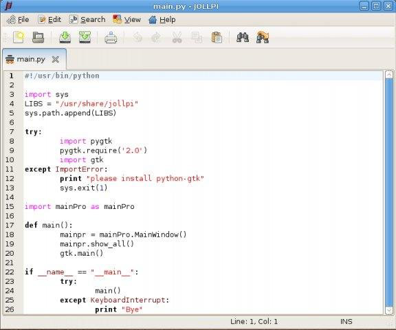

# Jollpi

> ⚠️ **Note:** This repository is for the legacy Python 2 / GTK 2 version (Jollpi 2.x).  
> The source code is hosted here on [GitLab](https://gitlab.com/zulfian1732/jollpi2-legacy).    
> The modern Python 3 / GTK 4 version is coming soon.

**Jollpi** is a lightweight, feature-rich text editor built using Python and GTK. Originally developed as a college final project in 2010, Jollpi is designed to be simple, fast, and useful for programmers working on Linux systems.

👉 **Jollpi** was originally hosted on SourceForge in 2011. You can still access the original project page here:  
[https://sourceforge.net/projects/jollpi](https://sourceforge.net/projects/jollpi)

## 🆕 Latest Version

The latest release, **Jollpi 2.1.3**, focuses on maintaining compatibility with **Python 2** and **GTK 2**, targeting modern Linux distributions (such as Manjaro and Arch Linux) that still provide **legacy Python 2 packages through AUR**.

Most required components — including **Python 2**, **GTK 2**, **PyGTK**, and **GtkSourceView 2** — remain accessible. However, **PyGtkSourceView 2 is no longer available in AUR**, and now requires manual installation from GNOME’s archived sources:

🔗 **PyGtkSourceView 2 Source Archive:**  
https://download.gnome.org/sources/pygtksourceview/2.10/

This release includes updated shebangs, revised installer scripts, and minor fixes for system integration.
For detailed changes, see the [ChangeLog](ChangeLog).



📹 **Demo Video**

A short demo showing Jollpi 2.1.3 running on Manjaro XFCE (Python2 + GTK2 environment):  
https://youtu.be/clwNFtF73BQ

## ✨ Features

- Tabbed interface for multiple documents
- Syntax highlighting for C/C++, Java, Python, Perl, Bash, and more (using GtkSourceView)
- File modification detection (external changes)
- Find, Find Next/Previous, Replace, and Go to Line
- Auto indent, Auto bracket, line numbers, line marks, and right margin display
- Font customization (family, size, style)
- Print and page setup support
- Wrap mode and theme switching
- Full undo/redo, clipboard support (cut/copy/paste)
- Accessible via command line:  
  ```bash
  jollpi2
  ```

## 🧭 Interface Overview
- Menubar – Full command access
- Toolbar – Quick access to frequently used actions
- Display area – The main editor window
- Statusbar – Shows cursor position, edit mode (INS/OVR), and contextual info

## ⌨️ Keyboard Shortcuts

| Action                 | Shortcut           |
|------------------------|--------------------|
| **New Document**       | Ctrl+N             |
| **Open File**          | Ctrl+O             |
| **Save**               | Ctrl+S             |
| **Save As**            | Ctrl+Shift+S       |
| **Print**              | Ctrl+P             |
| **Close File**         | Ctrl+W             |
| **Quit**               | Ctrl+Q             |
| **Undo**               | Ctrl+Z             |
| **Redo**               | Ctrl+Shift+Z       |
| **Cut**                | Ctrl+X             |
| **Copy**               | Ctrl+C             |
| **Paste**              | Ctrl+V             |
| **Select All**         | Ctrl+A             |
| **Delete**             | Delete             |
| **Find**               | Ctrl+F             |
| **Find Next**          | F3                 |
| **Find Previous**      | Shift+F3           |
| **Replace**            | Ctrl+R             |
| **Go to Line**         | Ctrl+G             |
| **Toggle Insert/Overwrite** | Insert        |
| **Toggle Auto Indent** | F8                 |
| **Toggle Line Numbers**| F11                |
| **Toggle Line Marks**  | F9                 |
| **Toggle Right Margin**| F7                 |
| **Select Font**        | F6                 |
| **Help**               | F1                 |

## 🚀 Version
**2.1.3**

## 📦 Installation

Run the provided script on any Linux-based system:

```bash
chmod +x install.sh
./install.sh
```

Make sure Python and GTK dependencies are installed. For details, see [INSTALL](INSTALL).

## 👨‍💻 Author

Zulfian

If you find **Jollpi** useful and want to support future updates, you can make a small contribution here:  
[**Send support via Ko-fi**](https://ko-fi.com/zulfian1732)

Your support helps keep the project maintained and compatible with modern Linux environments. ❤️

## 📄 License
See [LICENSE](LICENSE)
